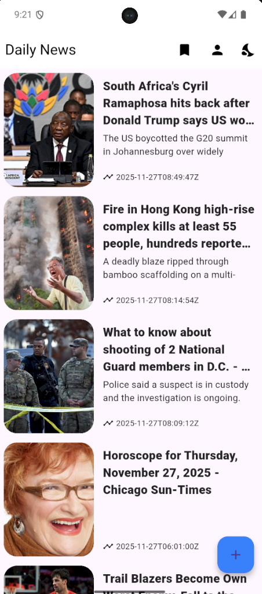
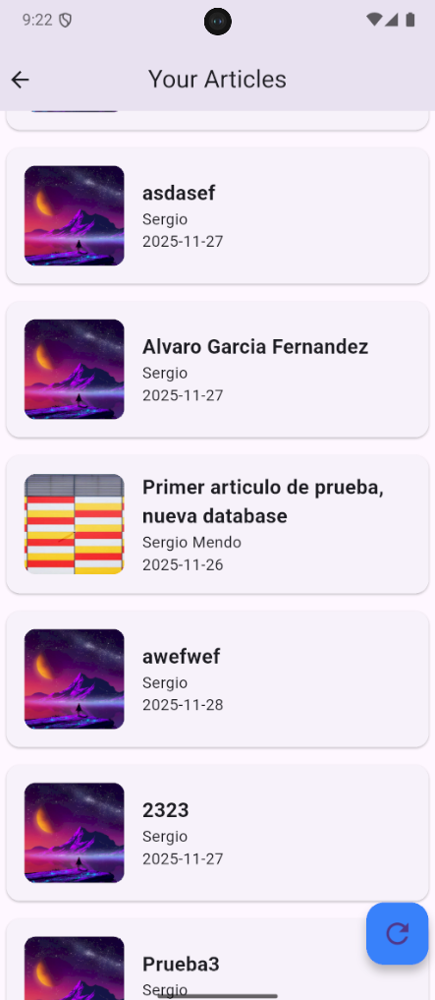
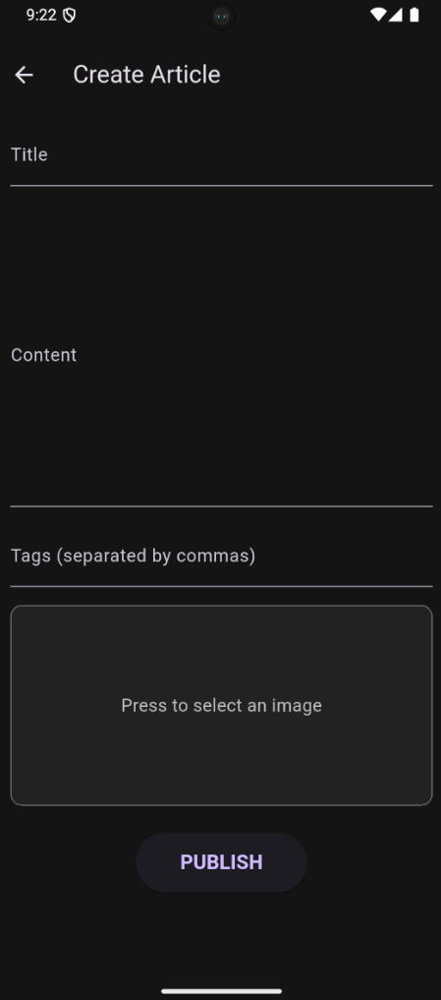

# 📱 Symmetry News App – Applicant Showcase

**Symmetry News App** is a mobile application developed in **Flutter** as part of the **Symmetry Applicant Showcase** technical assessment.  
The project focuses on demonstrating clean UI implementation, scalable and maintainable architecture, strong separation of concerns, and seamless integration with **Firebase Firestore**.  
It implements a modern news reader with reactive state management, clear data flow, and a structured Clean Architecture approach aligned with professional software engineering standards.

This repository showcases engineering practices that reflect Symmetry’s values:  
**Truth Is King**, **Total Accountability**, and **Maximally Overdeliver**.

---

## 🔗 Project Foundation

This project is based on the official starter repository provided by the Symmetry team:

➡️ **https://github.com/DiegoloM3/starter-project**

The starter project served as a structural foundation for implementing full data flow, business logic, UI presentation, and Firebase-powered backend operations.

---

## 🧭 Project Overview

The application includes two main screens:

### **1. Articles List Screen**
Displays a dynamic feed of articles fetched from Firestore, ordered by creation date.  
Each item presents an image, title, subtitle, and timestamp, forming a clean and readable layout.

### **2. Article Details Screen**
Displays full article information including title, subtitle, featured image, content body, and publication date.  
The layout is optimized for readability and supports both light and dark mode.

---

## 🚀 Features

### 📰 **News Feed**
- Retrieves all articles from Firestore’s `articles` collection  
- Ordered by `createdAt` timestamp (descending)  
- Clean and modern card-based UI  
- Includes image, title, subtitle, and date  

### 📄 **Article Details**
- Displays complete article content  
- Large header image for visual clarity  
- Responsive and readable layout  
- Dark/light theme support  

### ☁️ **Cloud Integration**
Each Firestore document follows this structure:

```json
{
  "title": "string",
  "subtitle": "string",
  "content": "string",
  "imageUrl": "string",
  "createdAt": "Timestamp"
}
``` 

## ▶️ Running the Project

Follow the steps below to run the application locally:

### **1️⃣ Install dependencies**
Install all required Flutter packages:
```bash
flutter pub get
```
### **2️⃣ Configure Firebase
If Firebase has not been configured for your environment yet, run:
```bash
flutterfire configure
```
This will generate the firebase_options.dart file and link the project to your Firebase app.
###** 3️⃣ Run the application
Start the app on your connected device or emulator:
```
flutter run
```

## 📸 Screenshots

Below are several screenshots showcasing the main screens of the application:

### Home



### Articles



